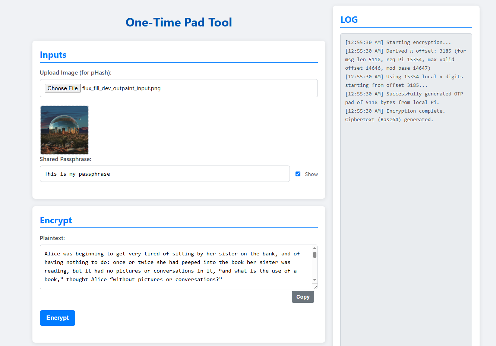

# PHash-Pi-OTP-Toolkit

A client-side, single-HTML file tool for one-time pad (OTP) inspired encryption/decryption, deriving its cryptographic pad from a perceptual image hash (pHash), a user-defined passphrase, and an embedded segment of the digits of Pi.

---

## Overview

`PHash-Pi-OTP-Toolkit` is a self-contained HTML/JavaScript application that implements a symmetric one-time pad encryption scheme. It generates a keystream by combining three user-influenced factors:

1.  A **perceptual hash (pHash)** derived from a user-uploaded image (can be resized or compressed within reason when decoding).
2.  A **secret passphrase** provided by the user.
3.  A deterministic selection of digits from an **embedded sequence of the constant Pi**.

The tool allows for both encryption of plaintext (UTF-8) to Base64 ciphertext and decryption of Base64 ciphertext back to plaintext. It operates entirely on the client-side, requiring no backend or external libraries beyond what's embedded in the single HTML file.

## Core Concepts

* **One-Time Pad (OTP) Principle:** The core encryption mechanism is a byte-wise XOR operation between the plaintext/ciphertext and a generated pad. If the pad were truly random and used only once, this would offer perfect secrecy. This tool approximates this by generating a pad that is highly dependent on unique inputs.

* **Perceptual Hashing (pHash):** Instead of a cryptographic hash of the image file itself (which would change with metadata modifications), a perceptual hash is computed. This hash represents the visual features of the image, meaning visually similar images will produce similar (but not necessarily identical) hashes. The pHash provides a source of initial entropy derived from the image content. This provides the advantage that the image can go through filters of social media, be resized, or compressed and still work when decoding. Cropping, however, can destroy the ability to decode.

* **Pi as a Pseudo-Random Source:** The digits of Pi are a reasonable source of pseudo-random digits. This tool embeds the first 30,000 digits of Pi (after the decimal) and uses a derived offset to select a segment of these digits for pad generation. But you could use any set of numbers or mathematical constants.

* **Key Derivation Function (KDF) - Custom:** The process of combining the pHash and passphrase to determine the starting offset in the Pi digits acts as a custom Key Derivation Function.

  

## Key Derivation & Pad Generation Process

The generation of the OTP pad is the crux of this tool's security model:

1.  **Image pHash Computation:**
    * The user uploads an image.
    * The image is drawn onto a 128x128 canvas.
    * An **Average Hash** algorithm is applied:
        * The 128x128 image is scaled down to an 8x8 pixel representation.
        * These 64 pixels are converted to grayscale.
        * The average grayscale value of these 64 pixels is calculated.
        * Each pixel's grayscale value is compared to the average: 1 if brighter or equal, 0 if darker.
        * This results in a 64-bit binary string, which is then converted to a 16-character hexadecimal string (e.g., `c3c3c3c3c3c3c3c3`). This is the `currentPHash`.

2.  **Passphrase Processing & Combination:**
    * The user provides a secret passphrase.
    * The passphrase is UTF-8 encoded into bytes (`passphraseBytes`).
    * The `pHashBytes` (8 bytes derived from `currentPHash`) are XORed with a "folded" version of the `passphraseBytes`. The folding process ensures that the entire passphrase contributes to an 8-byte intermediate key, which is then XORed with `pHashBytes`.
        * `tempPassphraseKey = new Uint8Array(pHashBytes.length)` (initialized to zeros)
        * For each byte in `passphraseBytes`: `tempPassphraseKey[i % pHashBytes.length] ^= passphraseBytes[i]`
        * `xorResultBytes[i] = pHashBytes[i] ^ tempPassphraseKey[i]`

3.  **Pi Offset Derivation:**
    * The `xorResultBytes` are converted to a hexadecimal string (`xorResultHex`).
    * The first 10 hexadecimal characters of `xorResultHex` are taken.
    * These 10 hex characters are parsed as a decimal integer (`decimalValue`).
    * The final `offset` into the Pi digits string is calculated as:
        `offset = decimalValue % (PI_DIGITS_30K.length - (messageByteLength * 3) + 1)`
        This ensures the offset is always valid for the given message length and the available Pi digits, preventing out-of-bounds reads.

4.  **OTP Pad Generation from Pi Digits:**
    * The tool uses an embedded string `PI_DIGITS_30K` containing the first 30,000 digits of Pi (after the decimal). This is arbitrary, but determines the max length of the message that can be encoded.
    * Starting from the calculated `offset`, a segment of Pi digits is extracted. The length of this segment is `messageByteLength * 3` (since 3 Pi digits are used to form each byte of the pad).
    * This segment of Pi digits is processed in 3-digit chunks.
    * Each 3-digit chunk is converted to an integer, and then `modulo 256` is applied to produce a byte value (0-255).
    * These bytes form the OTP pad.

## Encryption/Decryption

* **Encryption:**
    1.  Plaintext from the input textarea is UTF-8 encoded into bytes.
    2.  The OTP pad is generated as described above, matching the length of the plaintext byte array.
    3.  Each byte of the plaintext is XORed with the corresponding byte of the OTP pad.
    4.  The resulting byte array (ciphertext) is Base64 encoded and displayed.

* **Decryption:**
    1.  Base64 ciphertext is decoded into a byte array.
    2.  The OTP pad is regenerated using the *exact same image (pHash) and passphrase*. This is critical.
    3.  Each byte of the decoded ciphertext is XORed with the corresponding byte of the OTP pad.
    4.  The resulting byte array is UTF-8 decoded into plaintext and displayed.

## Security Considerations & Limitations

* **Client-Side Operation:** All cryptographic operations occur in the user's browser. No data (image, passphrase, plaintext, ciphertext) is transmitted to any server.
* **pHash Properties:** While distinct images will generally produce distinct pHashes, it's theoretically possible for two different images to yield the same pHash or pHashes that, when combined with a passphrase, lead to the same Pi offset for short messages. 
* **Passphrase Strength:** The "folding" mechanism of the passphrase (see step 2 above) ensures the entire passphrase contributes.
* **Key Uniqueness (Image + Passphrase):** The combination of the image's pHash and the full passphrase is what makes the derived Pi offset (and thus the OTP pad) unique.
* **Experimental Nature:** This tool is an educational and experimental implementation. For production-level security, use well-vetted, standardized cryptographic libraries and protocols.

## Technical Overview

* **Language:** HTML, CSS, JavaScript (ES6+).
* **Single File:** Designed to run as a single html file.
* **pHash Implementation:** Embedded "Average Hash" algorithm.
* **Pi Source:** Embedded string of the first 30,000 digits of Pi.
* **Encoding:** UTF-8 for text-to-byte conversion, Base64 for ciphertext representation.
* **Dependencies:** None (fully self-contained).

## How to Use

1.  Open `index.html` in a browser.
2.  **Upload Image:** Select an image file. Its pHash will be computed automatically. A preview is shown.
3.  **Enter Passphrase:** Type a secret passphrase.
4.  **Encryption:**
    * Enter plaintext in the "Plaintext" textarea.
    * Click "Encrypt".
    * The Base64 encoded ciphertext will appear in the "Ciphertext" textarea.
    * Log messages will detail the process.
5.  **Decryption:**
    * Ensure the **same image** is loaded and the **exact same passphrase** is entered.
    * Paste Base64 ciphertext into the "Ciphertext" textarea.
    * Click "Decrypt".
    * The recovered plaintext will appear in the "Plaintext" textarea.

---
